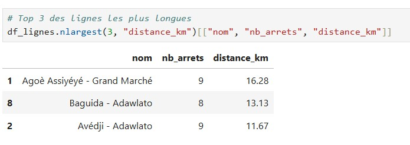
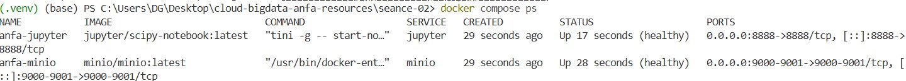

# Rendu - Séance 2
**Nom et prénom :** <MABOUDOU Georges N'Nabi>
**Identifiant GitHub :** <Mobgeo>
**Date de soumission :** <23/06/2026>
## Résumé de la séance
<2-4 lignes : Dockerfile écrit, image construite et exécutée, stack Compose à 3 services orchestrée, notebook Jupyter lisant MinIO.>
## Étapes principales
1. Écriture du Dockerfile et construction de l'image `anfa-analyse:v1` (taille observée : 1.17 Go).
2. Mise en place du `.dockerignore` et observation du cache de Docker.
3. Écriture du `docker-compose.yml` orchestrant MinIO, Jupyter, et l'image custom.
4. Création du notebook `exploration_minio.ipynb` qui lit les données depuis MinIO via boto3 et pandas.

## Captures d'écran
### docker compose ps

### Notebook Jupyter

## Bonus multi-stage (optionnel)
< Nous pouvons voir que la taille de l'image v1 (1.17 GO) est equivalente à la taille de l'image v2-multistage (1.17 GO), ce qui montre un gain de pourcentage nulle.>
## Réponses aux exercices d'application
<À compléter d'après les énoncés fournis avec l'assignment.>
## Difficultés rencontrées
j'ai rencontré des difficultés au niveau du build du stack v1 concernant les port d'ecoutes pour l'image Minio et pour le jupyter Notebook