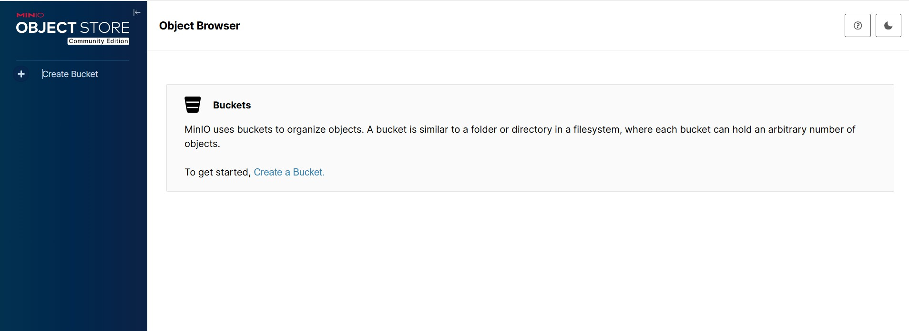
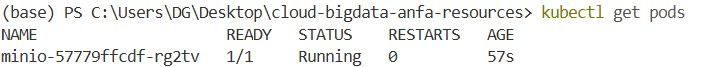
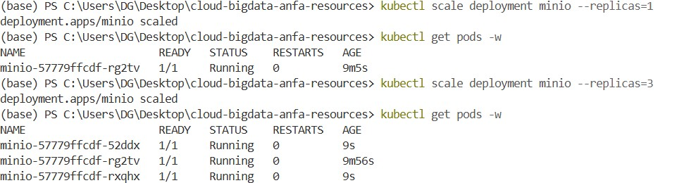

# Rendu Séance 3
**Nom et prénom :** <MABOUDOU Georges N'Nabi>
**Identifiant GitHub :** <Mobgeo>
**Date de soumission :** <26/06/2026>
## Résumé de la séance
<2-4 lignes : Kind installé, cluster Kubernetes créé, namespace anfa configuré, MinIO déployé via 3 manifestes YAML, self-healing observé, scaling testé, Ingress Controller activé.>
## Étapes principales
1. Installation de Kind et kubectl, création du cluster `anfa`.
2. Création du namespace `anfa` et configuration de kubectl.
3. Déploiement de MinIO via 3 manifestes YAML (PVC, Deployment, Service).
4. Observation du self-healing après suppression manuelle d'un pod.
5. Scaling du Deployment de 1 à 3 replicas, puis retour à 1.
6. Activation de l'Ingress Controller nginx.
## Captures d'écran
### Console MinIO accessible via port-forward

### Self-healing observé

### Scaling à 3 replicas

## Réponses aux exercices d'application
**EXERCICE 1**
1-B
2-B
3-C
4-C
5-B
6-B
7-B
8-B
9-B
**EXERCICE 2**
1-Le champ selector.matchLabels permet au Deployment d’identifier les Pods qu’il doit gérer, en se basant sur les labels définis dans template.metadata.labels, afin d’assurer que seuls les Pods correspondants sont contrôlés et mis à jour.
2- Kubernetes va creer deux pods. Si un des Pods tombe, Kubernetes détecte que le nombre de Pods actifs est inférieur à 2 et le Deployment déclenche automatiquement un recréation d’un nouveau Pod.
3-Minio est un nom de Service Kubernetes, pas une adresse IP fixe.
4-L’API est “vivante”, mais injoignable de manière stable
5-
`
apiVersion: v1
kind: Service
metadata:
  name: anfa-api
  namespace: anfa

spec:
  type: ClusterIP

  selector:
    app: anfa-api

  ports:
    - protocol: TCP
      port: 80        # port exposé dans le cluster
      targetPort: 8000 # port du conteneur
`
**EXERCICE3**
1-
a-Le statut ImagePullBackOff signifie que Kubernetes n’arrive pas à télécharger (pull) l’image Docker du conteneur, et qu’il réessaie après des délais de plus en plus longs (back-off).
b-La cause la plus probable ici est tout simplement une erreur dans le nom de l’image Docker. `miniooo` au lieu de `minio`.
c-La commande permettant d'obtenir plus de detail sur l'erreur est : `kubectl describe pod minio-7d9f8b6c5-x2k9p`
2-
a-Kubernetes n’a pas encore réussi à satisfaire la demande de stockage de 500Gi
b-La demande de stockage est trop grande (500Gi) et aucun volume ne peut être provisionné pour cette taille.
c-Elle affiche les événements détaillés liés au PVC, ce qui permet de voir exactement pourquoi il reste en Pending
3-
a-Cet erreur signifie que le pod associé au service minio n’est pas encore en état Running
b- la commande est `kubectl describe pod <nom-du-pod>`
c- l'ordre à respecter :
`kubectl apply -f <fichier.yaml>`
`kubectl get pods`
`kubectl get pods -w`
`kubectl describe pod <nom>`
`kubectl port-forward service/minio 9001:9001`

## Difficultés rencontrées
<Aucune>