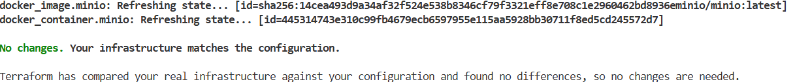
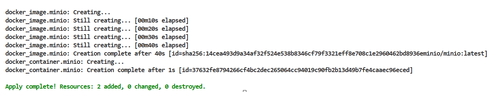
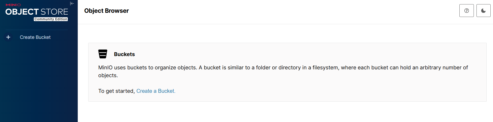
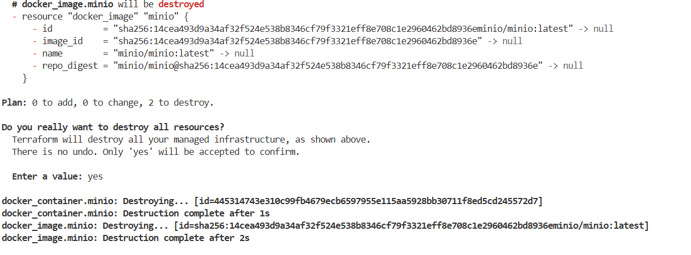

# Rendu — Séance 4
**Nom et prénom :** <Votre nom complet>
**Identifiant GitHub :** <votre-username>
**Date de soumission :** <JJ/MM/AAAA>
## Résumé de la séance
<2-4 lignes : Terraform installé, infrastructure Docker complète décrite en HCL, workflow plan/apply/destroy maîtrisé, code paramétré via variables.>
## Étapes principales
1. Installation de Terraform et premier `main.tf` minimal.
2. Maîtrise du workflow `init` → `plan` → `apply` → `destroy`.
3. Compréhension du state Terraform et bonnes pratiques de versioning.
4. Stack complète : réseau, volume, conteneur MinIO.
5. Refactoring en variables et fichier `.tfvars`.
## Captures d'écran
### terraform plan (création initiale)

### terraform apply réussi

### Console MinIO créée par Terraform

### terraform destroy

## Réponses aux exercices d'application
**EXERCICE1**
1-B
2-B
3-B
4-B
5-B
6-C
7-B
8-C
9-B
10-B

**EXERCICE2**
1-
| Ressource | Type | Rôle |
|---|---|---|
| `docker_network.back` | `docker_network` | Crée un réseau Docker isolé nommé `anfa-backend` pour que les conteneurs communiquent entre eux sans exposer ce trafic à l'extérieur. |
| `docker_volume.data` | `docker_volume` | Crée un volume Docker nommé `postgres-data` pour persister les données PostgreSQL même si le conteneur est supprimé. |
| `docker_image.postgres` | `docker_image` | Télécharge (pull) l'image Docker `postgres:15` depuis le registry et la rend disponible localement. |
| `docker_container.db` | `docker_container` | Lance le conteneur PostgreSQL en assemblant les 3 ressources précédentes : image, volume et réseau. |
2-
`docker_image.postgres.image_id` est une **référence d'attribut** Terraform. Elle suit la syntaxe :

```
<type_ressource>.<nom_local>.<attribut_exporté>
```

- `docker_image` → le type de ressource
- `postgres` → le nom local donné dans le fichier (`resource "docker_image" "postgres"`)
- `image_id` → l'attribut calculé **après** que Docker a pull l'image, qui contient le **SHA256 digest** réel de l'image (ex: `sha256:a3ed...`)
`image = "postgres:15"` permet à Terraform peut tenter de créer le conteneur avant que l'image soit prête alors que `image = docker_image.postgres.image_id` crée une dépendance implicite ui implique que le conteneur ne sera créé qu'après que l'image ait été pullée.
3- 
**Étape 1 — En parallèle** (aucune dépendance entre elles) :
- `docker_network.back`
- `docker_volume.data`
- `docker_image.postgres`

**Étape 2 — Après que les 3 précédentes soient terminées** :
- `docker_container.db`
4-
### Le problème

```hcl
env = [
  "POSTGRES_DB=anfa",
  "POSTGRES_USER=anfa_user",
  "POSTGRES_PASSWORD=secret123",   # ← MOT DE PASSE EN CLAIR !
]
```
Le mot de passe `secret123` est **hardcodé** dans le fichier `.tf`. Si ce fichier est commité dans Git, le secret est exposé dans l'historique pour toujours, même après suppression ultérieure.

De plus, Terraform stocke cet état dans `terraform.tfstate` **en clair**, ce qui constitue un second vecteur d'exposition.

### Correction concrète avec les variables sensibles
```hcl
# variables.tf
variable "postgres_password" {
  description = "Mot de passe PostgreSQL"
  type        = string
  sensitive   = true   # Terraform masquera la valeur dans les logs/outputs
}

# main.tf — on remplace la valeur hardcodée
resource "docker_container" "db" {
  name  = "anfa-postgres"
  image = docker_image.postgres.image_id
  env = [
    "POSTGRES_DB=anfa",
    "POSTGRES_USER=anfa_user",
    "POSTGRES_PASSWORD=${var.postgres_password}",   # ← référence à la variable
  ]
  # ... reste inchangé
}
```

Puis on crée un fichier **`terraform.tfvars`** (à ajouter dans `.gitignore`) :

```hcl
# terraform.tfvars  ← NE JAMAIS COMMITER CE FICHIER
postgres_password = "un_mot_de_passe_fort_ici"
```
5-
Terraform recrée tout depuis zéro (l'état est vide), avec le port `5433` car quand un attribut **immutable** d'une ressource change, Terraform détruit et recrée la ressource. Il indique `# forces replacement` dans le plan pour signaler ce comportement.

**EXERCICE3**
1-
a. Terraform a détecté une dépendance circulaire entre deux ressources : a attend b, et b attend a. Le graphe de dépendances forme une boucle sans point de départ possible.
b. Avant tout apply, Terraform construit un graphe orienté acyclique (DAG) pour déterminer l'ordre de création des ressources. Ce graphe doit être acyclique — c'est une contrainte fondamentale.
c. 
Comme solutio, je propose de remplacer les références dynamiques par des littéraux.
`
resource "docker_container" "a" {
  name  = "container-a"
  image = "alpine"
  env   = ["LINKED_TO=container-b"]
}

resource "docker_container" "b" {
  name  = "container-b"
  image = "alpine"
  env   = ["LINKED_TO=container-a"]
}
`
2-
a- Docker ne permet pas de modifier les variables d'environnement d'un conteneur déjà en cours d'exécution. Un conteneur est immuable une fois créé : ses paramètres de lancement (env, ports, command…) sont figés à l'instantiation.
Terraform reflète ce comportement : il sait que la ressource docker_container n'a pas d'API de mise à jour pour ces attributs. L'attribut env est donc marqué ForceNew dans le provider Docker — ce qui signifie que toute modification déclenche automatiquement un destroy + create.
b-
Non, les volumes seront perdues s'il s'agit de volume Docker nommé ou de Bind Mount.
c-
Non, elle a un coût opérationnel réel :
Interruption de service (downtime)

Le conteneur MinIO est destroy-é avant que le nouveau soit create-é. Pendant cet intervalle, le service est indisponible — toutes les applications qui lisent/écrivent sur MinIO échouent.
Risque de corruption

Si des écritures étaient en cours au moment du destroy, des fichiers peuvent rester dans un état incohérent.
Pas de rolling update

Contrairement à Kubernetes (qui recrée les pods progressivement), Terraform applique ici un remplacement brutal et séquentiel.
3-
a- 
Le fichier terraform.tfstate contient en clair toutes les métadonnées de l'infrastructure, notamment :
<li>
    <ol>
        Les clés d'accès et secrets (API keys, credentials cloud, mots de passe de bases de données)
    </ol>
    <ol>
        Les adresses IP privées, ARN, IDs de ressources sensibles
    </ol>
    <ol>
        Les certificats et tokens générés lors du provisionnement
    </ol>
</li>
b-
Le state récupéré représente l'état de l'infrastructure tel que Terraform l'a vu sur la machine de l'étudiant. Quand Awa lance terraform apply :
<li>
    <ol>
        Terraform compare son state local avec l'état réel du cloud. De cette manière il peut détecter des drifts et tenter de recréer ou détruire des ressources existantes.
    </ol>
    <ol>
        Si l'état est désynchronisé (ex. l'étudiant a déjà modifié l'infra depuis), Awa peut provoquer des destructions involontaires de ressources en production.
    </ol>
    <ol>
        En cas de conflit de state concurrent (les deux travaillent sur la même infra), la dernière écriture gagne → risque de corruption du state et d'infra incohérente.
    </ol>
</li>
c-
Il faut mettre en place un backend distant centralisé, par exemple avec AWS S3 + DynamoDB:
`
# backend.tf
terraform {
  backend "s3" {
    bucket         = "mon-projet-tfstate"
    key            = "prod/terraform.tfstate"
    region         = "eu-west-1"
    encrypt        = true          # Chiffrement côté serveur (AES-256)
    dynamodb_table = "terraform-locks" # Verrou d'état distribué
  }
}
`
Et ajouter impérativement dans .gitignore
`
*.tfstate
*.tfstate.backup
.terraform/
*.tfvars
`

**EXERCICE4**
############################################
# Provider
############################################
provider "docker" {}

############################################
# Variables
############################################
variable "minio_root_user" {
  type    = string
  default = "anfa-admin"
}

variable "minio_root_password" {
  type      = string
  sensitive = true
}

############################################
# Réseau Docker
############################################
resource "docker_network" "anfa_network" {
  name = "anfa-network"
}

############################################
# Volume MinIO
############################################
resource "docker_volume" "minio_data" {
  name = "minio-data"
}

############################################
# Image MinIO
############################################
resource "docker_image" "minio" {
  name = "minio/minio:latest"
}

############################################
# Conteneur MinIO
############################################
resource "docker_container" "minio" {
  name  = "anfa-minio"
  image = docker_image.minio.image_id

  networks_advanced {
    name = docker_network.anfa_network.name
  }

  ports {
    internal = 9000
    external = 9000
  }

  ports {
    internal = 9001
    external = 9001
  }

  env = [
    "MINIO_ROOT_USER=${var.minio_root_user}",
    "MINIO_ROOT_PASSWORD=${var.minio_root_password}"
  ]

  volumes {
    volume_name    = docker_volume.minio_data.name
    container_path = "/data"
  }

  command = [
    "server",
    "/data",
    "--console-address",
    ":9001"
  ]
}

############################################
# Image Jupyter
############################################
resource "docker_image" "jupyter" {
  name = "jupyter/scipy-notebook:latest"
}

############################################
# Conteneur Jupyter
############################################
resource "docker_container" "jupyter" {
  name  = "anfa-jupyter"
  image = docker_image.jupyter.image_id

  depends_on = [
    docker_container.minio
  ]

  networks_advanced {
    name = docker_network.anfa_network.name
  }

  ports {
    internal = 8888
    external = 8888
  }

  env = [
    "JUPYTER_TOKEN=anfa-token"
  ]
}

**EXERCICE5**
1-
Pour répondre aux contraintes (souveraineté, élasticité, accès public, etc.), je prévoirais au minimum :

Un bucket de stockage objet (Object Storage)
→ pour stocker les CSV et logs GPS chez OVHcloud.
Un cluster Kubernetes managé (ou cluster de compute scalable)
→ pour exécuter les traitements Spark avec auto-scaling.
Des instances de calcul (VM ou workers Kubernetes)
→ pour les traitements batch ou services backend.
Un service de load balancer public
→ pour exposer Grafana sur Internet.
Un réseau cloud (VPC / private network)
→ pour sécuriser les communications internes entre services.
2-
Je recommande l’approche B (plusieurs fichiers séparés) car elle:
- permet une meilleure lisibilité
- facilite le travail en équipe
- permet une maintenance plus simple
- favorise la modularité et la réutilisation.
3- deux mecanisme proposés pour la gestion d'environnements:
- Variables + fichiers .tfvars
- Workspaces Terraform
4-
La migration n’est pas triviale et demandera un effort important.
Les Migration partiellement réutilisable, mais nécessite une réécriture des ressources clés.
Le Temps dépend de la complexité, mais ce n’est clairement pas un simple copier-coller.
5- 3 pratiques essentielles :
- Remote state + verrouillage
- Utilisation de Git avec workflow clair
- Modularisation du code

## Difficultés rencontrées
<Aucune>