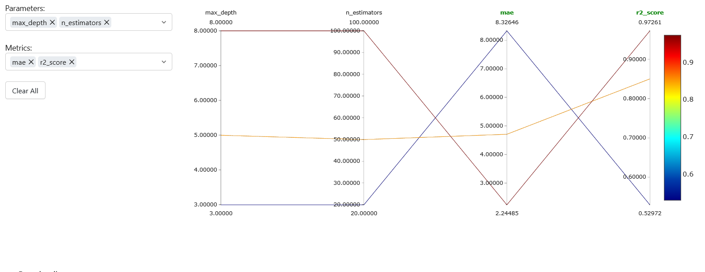

# Rendu — Séance 10

**Nom et prénom :** <MABOUDOU Georges N'Nabi>
**Identifiant GitHub :** <MobGeo>
**Date de soumission :** <14/07/2026>

## Résumé de la séance

Le fichier docker-compose.yml déploie un serveur MLflow accessible sur le port 5000, avec un stockage persistant (SQLite + artifacts). Trois runs d’entraînement ont été exécutés et comparés via l’interface MLflow. Le meilleur modèle a été enregistré puis promu en Production dans le Model Registry. Enfin, une fiche de conformité a été rédigée pour cadrer l’usage des données et du modèle.

## Étapes principales

1. Déploiement d'un serveur MLflow Tracking (SQLite + stockage local).
2. Génération d'un jeu de données d'affluence Anfa et entraînement de 3 variantes
   d'un modèle RandomForest, chacune tracée avec MLflow.
3. Comparaison des runs dans l'UI et identification du meilleur candidat.
4. Enregistrement du modèle dans le Model Registry, transition en statut Production.
5. Rédaction d'une fiche de conformité pour un scénario d'application mobile Anfa.

## Captures d'écran

### Tableau des 3 runs comparés

### Modèle enregistré en statut Production

## Réflexion personnelle

Le Model Registry permet à Kossi de résoudre son problème de traçabilité et de confusion entre versions de modèles : chaque modèle est versionné, documenté et associé à un statut clair (Staging, Production). Cela garantit qu’on sait toujours quel modèle est en production et pourquoi. Le lien avec Terraform est conceptuel : versionner un modèle revient à suivre l’évolution du code/data science, tandis que versionner une infrastructure (avec Terraform) permet de reproduire l’environnement technique. Les deux assurent reproductibilité, auditabilité et gouvernance du système global.

## Difficultés rencontrées

<Aucune | Décrivez brièvement.>
